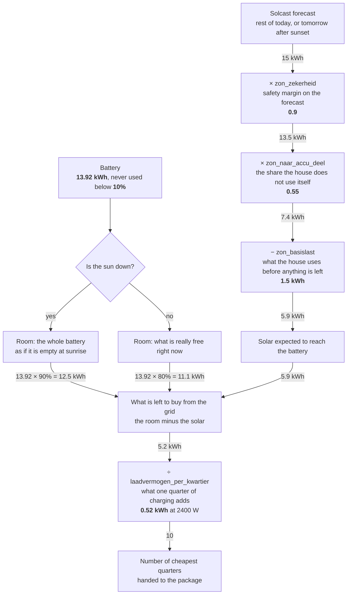

# Home Assistant automations

Automations that let appliances follow the electricity price and use the solar
left over. Each one is a separate YAML file.

## Files

| file | what it does |
|---|---|
| [`accu_dagplan_en_bijplan.yaml`](accu_dagplan_en_bijplan.yaml) | Fills the Zendure battery with solar and buys the rest in the cheapest quarter-hours, planned on the solar forecast. Sets the battery mode |
| [`vaatwasser_starten_op_de_goedkoopste_prijs.yaml`](vaatwasser_starten_op_de_goedkoopste_prijs.yaml) | Starts the selected program on the Siemens dishwasher, delayed until the cheapest window |
| [`boiler_verhogen_zonoverschot.yaml`](boiler_verhogen_zonoverschot.yaml) | Raises the hot water setpoint on the Ecoforest heat pump when there is really solar left over |
| [`warmtepomp_koeling_uit_bij_hoge_stroomprijs.yaml`](warmtepomp_koeling_uit_bij_hoge_stroomprijs.yaml) | Turns the Ecoforest heat pump off above EUR 0.50 per kWh when warm weather is forecast |

## Hardware

What I run. Other models from the same brands work, with different entity IDs.

- **Zendure SolarFlow** home battery (mine is a 2400 AC+)
- **Ecoforest** heat pump with its domestic hot water tank, controlled through
  an Eplucon Th-touch
- **Siemens** dishwasher on Home Connect
- **HomeWizard P1** meter, for grid import and export

## Battery charging/discharging logic

[`accu_dagplan_en_bijplan.yaml`](accu_dagplan_en_bijplan.yaml) makes two decisions: which mode
the battery runs in, and how much it tops up from the grid.

### Choosing the mode

Every quarter-hour it picks a mode, based on the solar left over, the price, and whether the
forecast fills the battery without the grid.

| solar left over | price | battery | what happens | mode |
|---|---|---|---|---|
| yes | any | fills from solar alone | solar fills the battery and covers the house | `Nul op de meter` |
| yes | cheapest quarter | will not fill from solar | solar fills the battery, the house buys the shortfall | `Alleen slim opladen` |
| no | cheapest quarter | will not fill from solar | the house buys, and the battery is saved for a more expensive hour | `Alleen slim opladen` |
| no | cheapest quarter, grid charging active | any | the battery charges from the grid, the house buys its own power | `Dynamisch NOM` |
| no | expensive | any | the battery supplies the house | `Nul op de meter` or `Dynamisch NOM` |

The mode names are Dutch, they come from the Gielz zenSDK package. A quarter
counts as cheap when the price is within the round trip loss of the lowest price
of the day, and below the day average. Moving a kWh through the battery costs
about 13 percent, so a smaller spread than that costs money instead of saving
it. On a flat day nothing qualifies.

### Topping up from the grid

When the sun is not expected to fill the battery, the automation buys the rest in the cheapest
quarters of the day. This is how it works out how much that is.

The settings in the boxes are mine. [Measured assumptions](#measured-assumptions) says where they
come from. The values on the arrows follow the example at the end of this section.

The forecast covers the rest of today, not the whole day, so it shrinks as the day goes on.
The package counts the cheapest quarters of the whole day, including ones already past, so the
automation looks for the position in the price list where exactly the quarters it wants are
still ahead. That is why the number it writes keeps growing during the day, even when the
battery needs less than it did an hour earlier. Quarters above the average never count:
charging then costs more than it saves. During the day that is the average of today, after
sunset the average of today and tomorrow together.

After sunset the quarters left today compete with all of tomorrow's. A quarter tonight is only
bought when it is cheaper than what tomorrow offers. Without this the automation would buy the
last quarters of the day just because the cheap ones were gone, not because they were cheap.

**A worked example.** A forecast of 15 kWh with the battery at 20 percent. The margin leaves
13.5 kWh, of which 0.55 × 13.5 − 1.5 = 5.9 kWh is expected to reach the battery. The battery
holds 13.92 kWh, so at 20 percent there is 11.1 kWh of room. That leaves 11.1 − 5.9 = 5.2 kWh
to buy from the grid: 5.2 ÷ 0.52 = **10 quarters**.

## Dependencies

Not every automation needs everything.

| automation | needs |
|---|---|
| [`accu_dagplan_en_bijplan.yaml`](accu_dagplan_en_bijplan.yaml) | zenSDK package, Solcast, Nordpool |
| [`vaatwasser_starten_op_de_goedkoopste_prijs.yaml`](vaatwasser_starten_op_de_goedkoopste_prijs.yaml) | Home Connect, Nordpool |
| [`boiler_verhogen_zonoverschot.yaml`](boiler_verhogen_zonoverschot.yaml) | Tech Controllers, zenSDK package, the P1 meter, and a power meter on the heat pump circuit |
| [`warmtepomp_koeling_uit_bij_hoge_stroomprijs.yaml`](warmtepomp_koeling_uit_bij_hoge_stroomprijs.yaml) | Tech Controllers, Nordpool, and a sensor with today's forecast high, from any weather integration |

| integration | provides |
|---|---|
| [Zendure zenSDK package](https://github.com/Gielz1986/Zendure-HA-zenSDK) | the battery entities, the mode selector and the dynamic price sensors |
| [Solcast](https://github.com/BJReplay/ha-solcast-solar) | the solar forecast for today and tomorrow |
| [Nordpool](https://github.com/custom-components/nordpool/) | the quarter-hour prices, tax and surcharges included. Take the HACS one, not the Nord Pool integration that ships with Home Assistant |
| [Home Connect](https://www.home-assistant.io/integrations/home_connect) | the dishwasher door, program and remote start |
| [Tech Controllers](https://github.com/mariusz-ostoja-swierczynski/tech-controllers) | the heat pump: the hot water setpoint and the on/off switch |
| [Eplucon](https://github.com/koenhendriks/ha-eplucon) | readings from the same heat pump, used here only for the water temperature in a notification |

## Measured assumptions

The numbers in [`accu_dagplan_en_bijplan.yaml`](accu_dagplan_en_bijplan.yaml) come from measurements on my own
installation.

| variable | value | source |
|---|---|---|
| `accu_inhoud` | 13.92 kWh | Zendure SolarFlow 2400 AC+ with five packs |
| `laadvermogen_per_kwartier` | 0.52 kWh | 2400 W charging power, times the round trip |
| `zon_naar_accu_deel` | 0.55 | calibrated on 355 days of generation and feed-in |
| `zon_basislast` | 1.5 kWh | same |
| `rendement` | 0.87 | round trip, just below the measured 87.6 percent |
| `zon_zekerheid` | 0.9 | Solcast runs high more often than low; a bigger margin would buy solar you would have had for free |

[`boiler_verhogen_zonoverschot.yaml`](boiler_verhogen_zonoverschot.yaml) uses a threshold of 2400 W, based on the
measured 2177 W draw during water heating.
